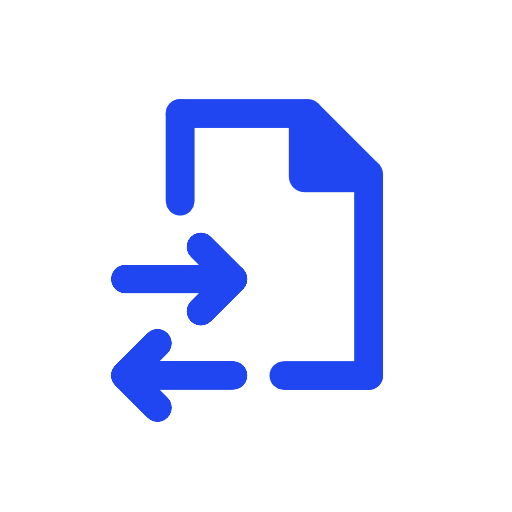

# RemoteFiles

RemoteFiles is a SFTP client for Android and iOS and was developed with [Flutter](https://flutter.dev).

The [ssh package](https://pub.dev/packages/ssh) is used to connect to SFTP, which wraps iOS library [NMSSH](https://github.com/NMSSH/NMSSH) and Android library [JSch](http://www.jcraft.com/jsch/).

The connections are saved in two JSON files (favorites.json & recentlyAdded.json) in the ApplicationDocumentsDirectory. To get the ApplicationDocumentsDirectory the [path_provider package](https://pub.dev/packages/path_provider) is used.

Downloaded files are saved to external storage, which needs 'WRITE_EXTERNAL_STORAGE' permission. To handle this permission the [permission_handler package](https://pub.dev/packages/permission_handler) is used.

## Downloads

- [APK file](https://github.com/niklas-8/RemoteFiles/releases)
- Google PlayStore (not yet available)

## Screenshots

  
  