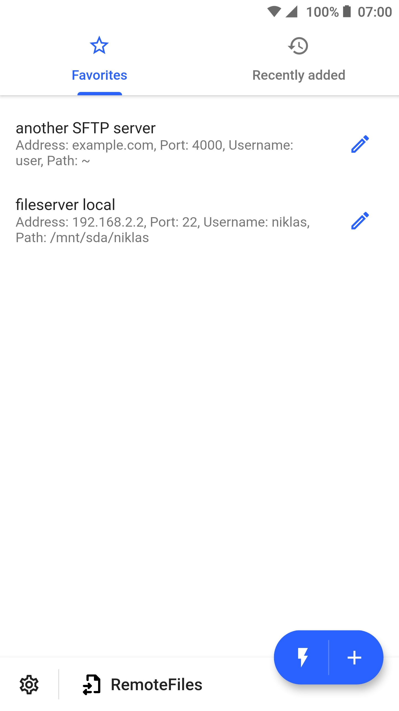
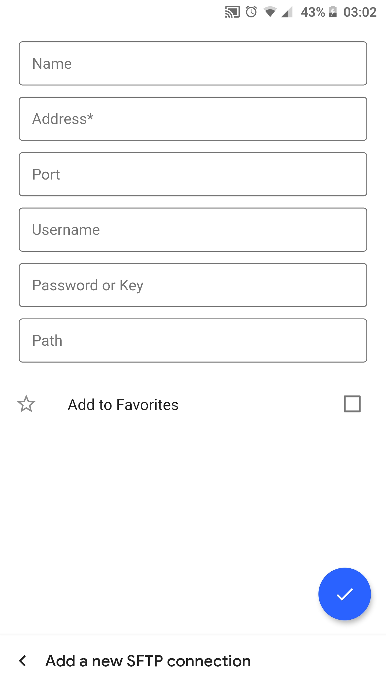
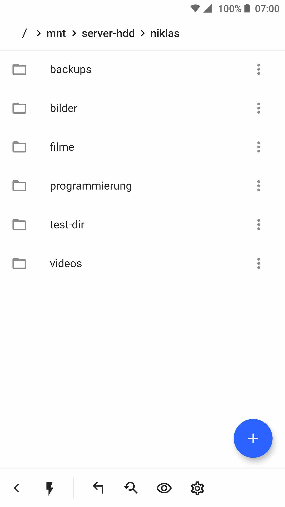
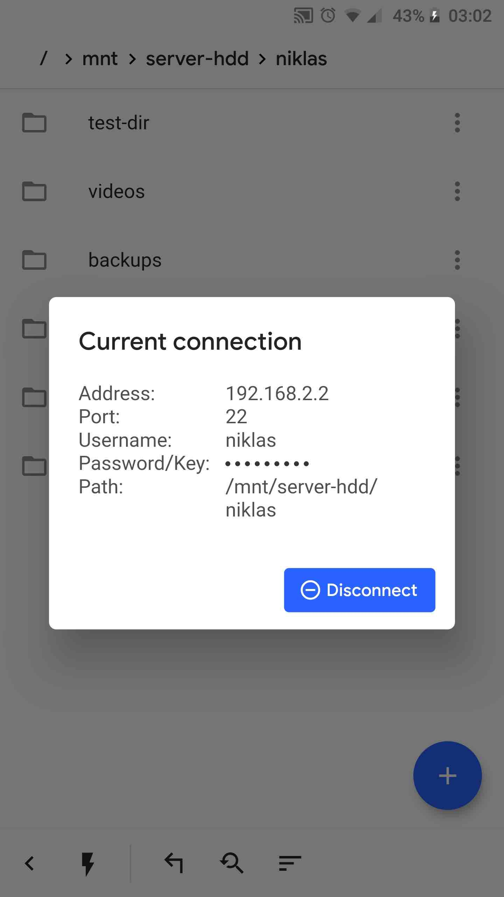
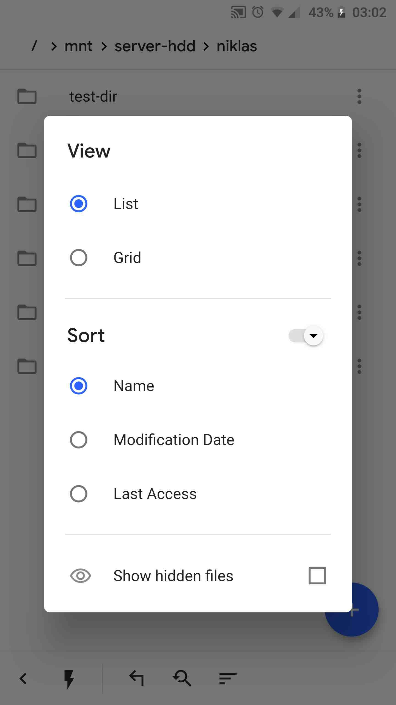
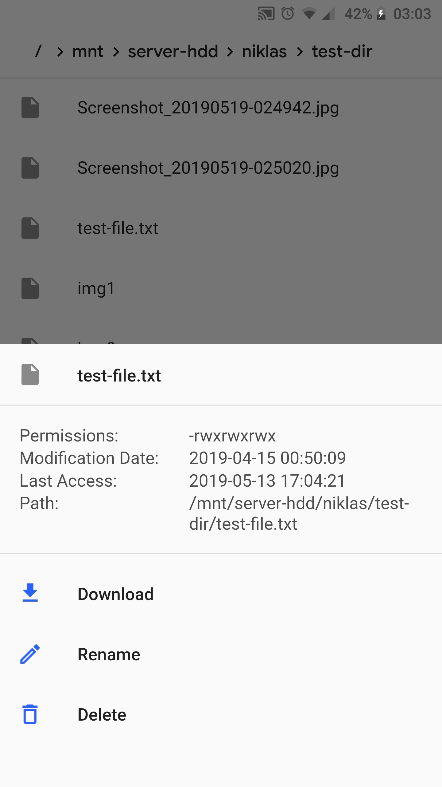
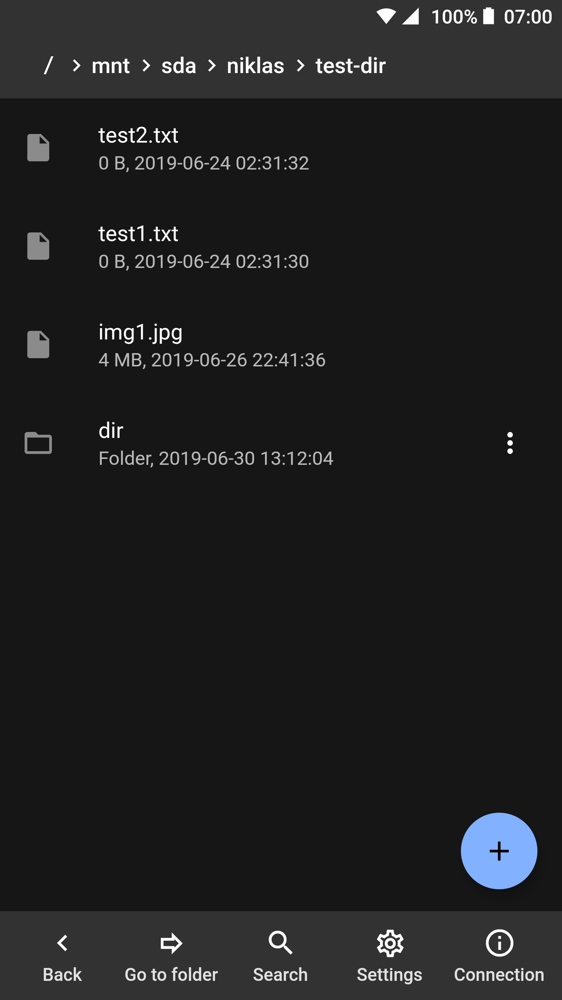
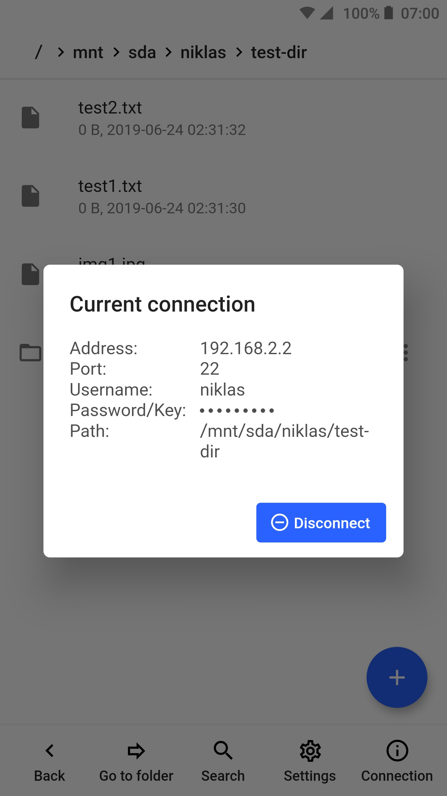
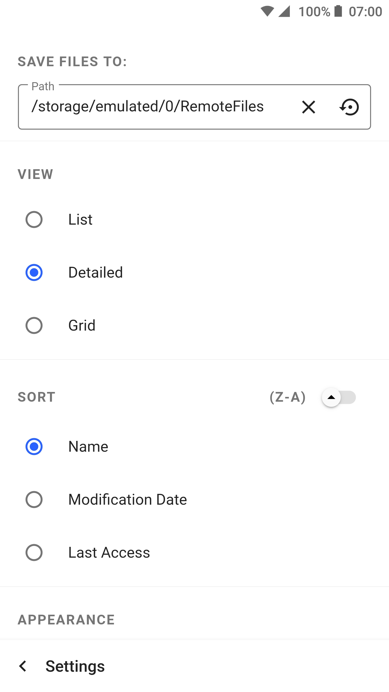

  

<h1 align="center" style="font-weight: 600">RemoteFiles</h1>

RemoteFiles is a SFTP client for Android and iOS and was developed with <a href="https://flutter.dev">Flutter</a> in the <a href="https://dart.dev">Dart</a> Programming Language.

  <a href="https://niklas-8.github.io/RemoteFiles">Website</a> · 
  <a href="https://github.com/niklas-8/RemoteFiles/releases">Releases</a>

---

## Downloads

- [APK file](https://github.com/niklas-8/RemoteFiles/releases)
- Google PlayStore (not yet available)

## Information

#### SFTP connection
The [ssh](https://pub.dev/packages/ssh) package is used to connect to SFTP, which wraps iOS library [NMSSH](https://github.com/NMSSH/NMSSH) and Android library [JSch](http://www.jcraft.com/jsch/).

#### Connection data
The connections are saved in two JSON files (favorites.json & recentlyAdded.json). 
On Android the files are located in the ApplicationDocumentsDirectory. 
On iOS the files are located in the ApplicationSupportDirectory.

#### Downloaded files
On Android the downloaded files are saved to external storage (default: /storage/emulated/0/RemoteFiles). The location can be changed on Android in the settings. 
On iOS the downloaded files are saved in the ApplicationDocumentsDirectory.

#### Get directories
The [path_provider](https://pub.dev/packages/path_provider) package is used to get the directories listed above.

#### Permissions
To save files to external storage, the `WRITE_EXTERNAL_STORAGE` permission is needed on Android. To request and check this permission the [permission_handler](https://pub.dev/packages/permission_handler) package is used.

#### Analytics
User data is tracked with the [firebase_analytics](https://pub.dev/packages/firebase_analytics) package.

#### Get latest available version
The releases on GitHub are received with the GitHub API and the [http](https://pub.dev/packages/http) package in the JSON format. To get the latest version the releases are compared with the `published_at` key. Then the version numbers of the latest available version and the currently used version are compared. The version number of the latest available version is determined by the `tag_name`. The version number of the currently used version is determined by the pubspec.yaml file. To get this version number the [package_info](https://pub.dev/packages/package_info) package is used.

## Screenshots

  
  
  